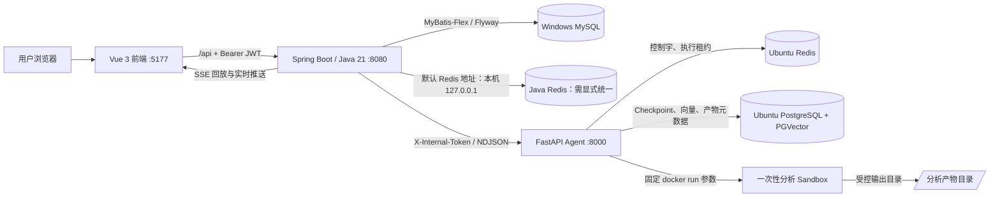

# InsightHub 当前系统说明与部署手册

> 适用代码库：`InsightHub-` 当前工作区
> 更新日期：2026-08-23
> 面向对象：开发、测试、部署与后续维护人员

## 1. 文档范围与当前状态

InsightHub 是一个以工作空间为隔离边界的多智能体研究与知识生产平台。浏览器通过 Vue 前端访问 Java 平台服务；Java 负责 JWT、RBAC、任务状态机、MySQL 持久化、SSE 推送和对 Python Agent 的受控调用；Python Agent 负责 LangGraph 工作流、知识库检索、分析 Sandbox、PGVector 元数据和内部文件服务。

当前部署拓扑为：Windows 运行前端、Java 和既有 MySQL；Ubuntu 虚拟机运行 Python Agent、Redis、PGVector 与 Docker Sandbox。

截至本文档更新时，以下基础设施已实际验证：

| 项目 | 状态 | 说明 |
| --- | --- | --- |
| Ubuntu Agent | 已运行 | `insighthub-agent` 为 `active`，`GET /health` 返回 `{"status":"ok"}` |
| Redis | 已运行 | Docker 容器健康，端口仅绑定 Ubuntu 本机 `127.0.0.1:6379` |
| PGVector | 已运行 | Docker 容器健康，端口仅绑定 Ubuntu 本机 `127.0.0.1:5432` |
| Sandbox 镜像 | 已构建 | `insighthub-analysis-sandbox:1.0.0` |
| Ubuntu 防火墙 | 已收紧 | 仅允许 Windows 宿主机 `192.168.100.1` 访问 TCP 22、8000 |
| Docker TCP API | 未暴露 | 未监听 2375/2376；Docker 仅使用本地 Unix Socket |
| Windows → Agent | 已验证 | `http://192.168.100.129:8000/health` 可访问 |

本文不记录真实令牌、密码、数据库连接密码或模型密钥；所有示例均使用占位符。

## 2. 总体架构



### 2.1 信任边界

- 浏览器只访问 Java 的 `/api/**`；Python 的 `/internal/**` 不是对外业务 API。
- Java 以 JWT 验证当前用户，以工作空间成员关系和任务归属完成第一层授权。
- Java 调用 Python 时自动附加 `X-Internal-Token`；Python 中间件仅允许携带正确令牌的 `/internal/v1/**` 请求。
- Python 产物元数据和文件读取均按 `workspaceId + taskId + artifactId` 精确过滤；Java 再次校验 MIME、文件名与大小。
- Redis、PGVector 与 Docker Socket 不向局域网暴露；仅 Agent 服务的 8000 经 UFW 向 Windows 宿主机开放。

## 3. 仓库结构与职责

```text
InsightHub-
├── backend-java/                 # Spring Boot 平台服务
│   ├── src/main/java/...          # Controller、Service、Mapper、Security、Integration
│   └── src/main/resources/        # application.yml、Flyway 迁移、字体等资源
├── agent-service-python/          # FastAPI + LangGraph Agent
│   ├── app/agents/                # Planner、Researcher、Critic、Writer、Analysis
│   ├── app/api/                   # 内部任务、知识库、产物接口
│   ├── app/services/              # Runner、Checkpoint、Sandbox、产物服务
│   └── Dockerfile.sandbox         # 固定分析镜像
├── insightHub-frontend/           # Vue 3 + TypeScript + Vite 前端
├── deploy/
│   ├── postgres/init/             # PGVector 初始化 SQL
│   └── ubuntu/                    # Compose、systemd、Bootstrap、Ubuntu 说明
├── docs/                          # 协议、库表与本文档
├── scripts/                       # Windows 本地辅助脚本
├── pyproject.toml + uv.lock       # uv workspace 根定义及锁定依赖
└── .env.example                   # 不含真实机密的环境变量模板
```

`pyproject.toml` 与根目录 `uv.lock` 是 uv workspace 的一部分。部署 Agent 时必须一并发布，不能只复制 `agent-service-python` 目录；安装依赖时必须显式选择 `insighthub-agent-service` 包，否则会漏装工作区中定义的 Agent 依赖，例如 `psycopg`、`redis` 和 `langgraph-checkpoint-postgres`。

## 4. Java 平台服务

### 4.1 技术栈

| 类别 | 当前实现 |
| --- | --- |
| 运行时 | JDK 21、Spring Boot 3.3.5 |
| Web | Spring MVC；WebClient 用于调用 Agent |
| 持久化 | MyBatis-Flex 1.11.8、MySQL Connector/J、Flyway |
| 安全 | Spring Security、JJWT |
| 协作 | Spring Data Redis、Redisson |
| 文档 | springdoc / Knife4j |
| 报告导出 | CommonMark、OpenHTMLtoPDF/PDFBox |

服务监听端口由 `JAVA_SERVER_PORT` 控制，默认值为 `8080`。

### 4.2 分层约定

Java 包根为 `com.hechang.insighthub`。当前代码采用以下职责划分：

```text
controller
  └── HTTP 参数绑定、Bean Validation、响应映射、SSE/文件响应
service
  └── 面向调用方的业务接口
service.impl
  └── 业务编排、权限、事务、状态机与外部协作
mapper
  └── MyBatis-Flex 实体映射、语义化查询、原子 SQL
model.dto / model.entity
  └── API 数据模型 / 数据库实体
integration
  └── Agent、知识库等远程调用适配器
```

单实体聚合服务使用 MyBatis-Flex 通用能力，例如：

```java
public class AgentServiceImpl
        extends ServiceImpl<AgentDefinitionMapper, AgentDefinition>
        implements AgentService {
}
```

`save`、`getById`、`getOne`、`list`、`count`、`UpdateChain` 等用于普通 CRUD；必须保持原子性的操作仍位于 Mapper，例如任务状态 CAS、`FOR UPDATE` 行锁、Outbox 领取、事件去重和跨表 JOIN。多实体事务、文件导出、远程代理等不强行继承 `ServiceImpl`，例如 `TaskResultServiceImpl`、`ReportExportServiceImpl` 和 `AnalysisArtifactServiceImpl`。

### 4.3 安全与工作空间授权

1. `JwtAuthFilter` 从 `Authorization: Bearer <accessToken>` 建立当前用户身份。
2. Controller 调用 Service 接口，不直接访问 Mapper 或实现类。
3. `WorkspaceAccessService` / `CurrentWorkspaceAccess` 检查当前用户是否属于目标工作空间，并按 OWNER、ADMIN、MEMBER 等角色限制操作。
4. 所有工作空间资源查询或更新均携带 `workspaceId`。任务、知识库、文档、报告和产物不能通过仅传资源 ID 跨空间读取。
5. 唯一的 SSE 兼容例外是任务事件接口可使用 `access_token` 查询参数；其他 API 均应使用 Bearer 请求头。

### 4.4 任务状态、Outbox 与事件流

创建异步任务后，Java 保存 `research_task`，再通过 `task_dispatch_outbox` 可靠地派发到 Python。任务执行不是在数据库事务内同步执行：事务仅持久化业务状态与 Outbox，后台 Worker 再发起远程 NDJSON 流请求。

核心流程如下：

1. 用户提交研究问题、可选知识库 ID 和 `enableDataAnalysis`。
2. Java 检查工作空间成员资格、创建任务与执行轮次，并将调度命令放入 Outbox。
3. `TaskDispatchWorker` / `TaskDispatchExecutor` 调用 Python `/internal/v1/agent/tasks/stream`。
4. Java 读取每条 NDJSON 事件，使用 `(task_id, event_no)` 唯一键幂等落库到 `task_event`。
5. `TaskEventPublisher` 与 `TaskEventSseHub` 将事件推送给前端；SSE 断开后，客户端通过 `Last-Event-ID` 或 `fromEventNo` 补读。
6. 终态结果由短事务保存任务状态、报告、引用；远程调用、SSE 推送、文件流均不放入该事务。

任务控制包含暂停、恢复、取消和失败重试。状态迁移以条件更新实现，避免旧执行轮次覆盖新重试轮次；事件投递语义是 **at-least-once**，前端必须按 `eventId` 去重。

### 4.5 报告版本、引用与导出

- 每次成功完成任务，`TaskResultService` 在同一任务下创建新的不可变报告版本。
- 持久化时锁定任务行、计算下一个版本号，并依赖 `(task_id, version)` 唯一约束防止并发重复版本。
- 引用以 `report_id` 关联，而非覆盖性地按 `task_id` 删除，因此旧报告版本仍保留各自引用。
- HTML 从指定版本 Markdown 即时渲染；PDF 从 HTML 即时生成。下载接口不使用 `BaseResponse`，直接返回正文、MIME、UTF-8 文件名和 `Content-Disposition: attachment`。

### 4.6 分析产物代理

`AnalysisArtifactServiceImpl` 是 Java 的公开边界代理，不直接连接 PGVector。处理过程：

1. 先验证工作空间成员资格与任务归属。
2. 调用 Python 内部产物元数据或文件接口。
3. 只允许 `text/csv`、`application/json`、`application/vnd.apache.parquet`、`image/png`、`image/svg+xml`。
4. 限制单次代理最大 20 MiB，读取过程中再次累计字节数。
5. 清洗服务端返回的文件名，使用 `StreamingResponseBody` 流式写回浏览器。

宿主机路径、`storageUri`、Sandbox 脚本正文和完整标准输出均不进入浏览器响应。

## 5. Python Agent

### 5.1 运行模型与内部认证

Agent 使用 FastAPI 暴露健康检查与内部接口，使用 LangGraph 执行研究图。`app.core.internal_auth.require_internal_token` 是全局 HTTP 中间件：

- `/health` 不要求内部令牌，以便 systemd 或本机探针检查进程存活。
- `/internal/v1/**` 必须带 `X-Internal-Token`，且与 `AGENT_INTERNAL_TOKEN` 恒定时间比较。
- 若服务进程环境中未显式设置 `AGENT_INTERNAL_TOKEN`，内部接口返回 `503 INTERNAL_AUTH_NOT_CONFIGURED`，而不是从意外文件回退启用。

### 5.2 LangGraph 工作流

主要节点包括 Planner、Supervisor、Web/Knowledge Researcher、Evidence Verifier、Critic、可选 Data Analysis 和 Writer。概念流程如下：

```text
PLAN → 研究与证据收集 → Evidence Verifier → Critic
     ├─ 需要补充 → Supplement Research → Critic
     ├─ 不通过   → 失败
     └─ 通过     → [enableDataAnalysis ? Data Analysis : 跳过] → Writer → 报告
```

- `requirePlanApproval=true` 时，图可停在计划审批状态，等待 Java 转发批准或修订操作。
- Critic 最多进行两轮；补充研究任务最多两个。
- Redis 用于控制字与执行租约；PostgreSQL Checkpoint 是生产默认后端。测试可显式切换为 memory。
- 流式接口按 NDJSON 输出节点事件，最后一行输出 `TASK_RESULT`。

### 5.3 知识库与 RAG

Python 负责文本解析、分块、嵌入、PGVector 存储和混合检索；Java 负责知识库、文档、权限及上传元数据。检索请求始终带 `workspaceId` 与知识库 ID 列表，避免跨空间召回。

文档状态由 Java 维护：`PENDING → PARSING → INDEXED | FAILED`。上传、数据库落库和事务提交完成后，再通过事件监听器异步请求 Python 入库，避免异步线程读到未提交的数据。

### 5.4 数据分析 Sandbox

数据分析仅在创建任务时传入 `enableDataAnalysis=true` 时执行。当前实现并非让模型直接生成任意 Python，而是执行一段固定的证据汇总脚本：生成 CSV、JSON，并在存在证据时生成 PNG 柱状图。

在执行前，节点仅选择最多 100 条已验证证据，并只保留如下白名单字段：`id`、`sourceTitle`、`sourceUri`、`sourceType`、`verified`、`quotedText`。无可分析证据时发出 `SANDBOX_COMPLETED` 且 `artifactCount=0`，任务不失败。

Sandbox 的固定安全约束：

| 约束 | 当前实现 |
| --- | --- |
| 网络 | `--network=none` |
| 身份 | 数值非 root 用户 `65534:65534` |
| 文件系统 | `--read-only`；仅 `/input:ro` 与 `/output:rw` 挂载 |
| 提权 | `no-new-privileges`、`--cap-drop=ALL` |
| 资源 | CPU、内存、PID、超时、临时目录大小均固定于服务端配置 |
| 输出 | 只登记 CSV、JSON、Parquet、PNG、SVG；限制最多 8 个、合计最多 20 MiB |
| 代码检查 | 内置脚本解析 AST，并限制导入模块与危险调用 |

Docker CLI 或固定镜像不可用时，节点发出 `SANDBOX_FAILED`，错误码为 `SANDBOX_UNAVAILABLE`；运行超时或执行失败使用 `SANDBOX_FAILED`。事件与对外错误不应暴露 Docker 命令、宿主路径或机密。

## 6. 对外与内部 API

除 SSE 和文件导出/下载外，Java 对外 API 返回统一信封：

```json
{ "code": 0, "data": {}, "message": "ok" }
```

项目的异常处理沿用“业务错误码优先”的约定，客户端必须判断 `code`，不要只依据 HTTP 状态码。

### 6.1 常用公开 API

| 模块 | 基础路径 | 主要能力 |
| --- | --- | --- |
| 认证 | `/api/v1/auth` | 注册、登录、刷新令牌、当前用户 |
| 工作空间 | `/api/v1/workspaces` | 创建、列出、成员管理与角色控制 |
| Agent 定义 | `/api/v1/workspaces/{workspaceId}/agents` | Agent 创建、更新、启停、查询 |
| 知识库 | `/api/v1/workspaces/{workspaceId}/knowledge-bases` | 知识库、文档上传、查询、禁用、重建索引 |
| 研究任务 | `/api/v1/workspaces/{workspaceId}/research/tasks` | 创建、任务控制、计划审批、SSE、报告、引用、产物 |

研究任务的关键端点：

| 方法 | 路径 | 说明 |
| --- | --- | --- |
| POST | `/` | 异步创建，返回 202 |
| POST | `/sync` | 同步执行，主要用于兼容或演示 |
| GET | `/{taskId}`、`/` | 任务详情、任务列表 |
| GET | `/{taskId}/events` | SSE；支持 `Last-Event-ID` / `fromEventNo` |
| POST | `/{taskId}/pause`、`/resume`、`/cancel`、`/retry` | 任务控制 |
| GET/POST | `/{taskId}/plan`、`/plans`、`/plan/approve`、`/plan/revise` | 计划、审批与修订 |
| GET | `/{taskId}/report` | 最新报告 |
| GET | `/{taskId}/reports`、`/{version}` | 版本列表与指定版本 |
| GET | `/{taskId}/reports/{version}/exports/html` | HTML 下载 |
| GET | `/{taskId}/reports/{version}/exports/pdf` | PDF 下载 |
| GET | `/{taskId}/artifacts` | 分析产物元数据 |
| GET | `/{taskId}/artifacts/{artifactId}/content?disposition=inline|attachment` | 预览或下载产物 |
| GET | `/{taskId}/citations` | 报告引用 |

### 6.2 Java ↔ Python 内部 API

| 方法 | Python 路径 | 目的 |
| --- | --- | --- |
| POST | `/internal/v1/agent/tasks` | 同步研究任务 |
| POST | `/internal/v1/agent/tasks/stream` | NDJSON 任务流 |
| POST | `/internal/v1/agent/tasks/{taskId}/resume` | 从 Checkpoint 恢复 |
| POST | `/internal/v1/agent/tasks/{taskId}/plan/approve` | 批准计划并继续 |
| POST | `/internal/v1/knowledge/documents/ingest` | 文档解析、切分、向量入库 |
| POST | `/internal/v1/knowledge/retrieve` | 混合检索 |
| POST | `/internal/v1/knowledge/chunks/delete-by-kb` | 清理知识库片段 |
| GET | `/internal/v1/agent/tasks/{taskId}/artifacts` | 获取安全产物元数据 |
| GET/HEAD | `/internal/v1/agent/tasks/{taskId}/artifacts/{artifactId}/content` | 读取受控产物文件 |

所有内部 API 都需要 `X-Internal-Token`。Java 在 `AppConfig` 中若发现 `AGENT_BASE_URL` 或 `AGENT_INTERNAL_TOKEN` 为空，会拒绝启动，防止回退到旧虚拟机地址或无认证调用。

## 7. 数据存储

### 7.1 Windows MySQL：业务事实来源

Flyway 位于 `backend-java/src/main/resources/db/migration`：

| 迁移 | 内容 |
| --- | --- |
| `V1__baseline_schema.sql` | 用户、工作空间、Agent、任务、事件、知识库、报告、引用、审计等基础表 |
| `V2__day1_plan_revision.sql` | 计划修订表和当前计划投影 |
| `V3__day2_plan_dispatch_outbox.sql` | 异步派发 Outbox |
| `V4__research_task_analysis_flag.sql` | `research_task.enable_data_analysis` 开关 |

关键关系：

- `research_task` 是任务状态机主表，含 `workspace_id`、当前 `run_id`、错误信息、配置与 `enable_data_analysis`。
- `task_event` 使用 `(task_id, event_no)` 唯一键，支撑事件幂等与 SSE 回放。
- `report` 使用 `(task_id, version)` 唯一键保存不可变版本。
- `citation.report_id` 关联具体报告版本，使历史引用可追溯。
- `task_dispatch_outbox` 提供调度重试与可靠派发。
- `knowledge_base`、`document` 保存知识库与上传文件元数据，文件正文不在 MySQL 中。

### 7.2 Ubuntu PGVector：检索、Checkpoint 与产物元数据

PGVector 容器保存：

- 知识库文档片段、向量与检索元数据；
- LangGraph 的 PostgreSQL Checkpoint；
- `analysis_artifact` 分析产物元数据。

`analysis_artifact` 中的 `storage_uri` 是 Python 私有实现字段。列表接口只返回安全元数据，文件读取时才由 Agent 在服务端解析该 URI 并进行目录穿越检查。

### 7.3 文件目录

Ubuntu 上的约定目录：

| 目录 | 用途 | 所有者/访问边界 |
| --- | --- | --- |
| `/opt/insighthub/agent` | 完整仓库发布副本和 Python 虚拟环境 | `insighthub` 服务账户读取/运行 |
| `/opt/insighthub/artifacts` | Sandbox 的任务输入、输出和产物文件 | Agent 与受限容器使用 |
| `/opt/insighthub/volumes` | Redis、PGVector Docker 卷 | Docker 管理 |
| `/etc/insighthub/agent.env` | Agent 机密环境变量 | `root:insighthub`，最小读取权限 |

## 8. 前端能力

前端使用 Vue 3、TypeScript、Vite、Pinia、Vue Router 与 Ant Design Vue，开发端口为 `5177`，`/api` 代理到 `http://127.0.0.1:8080`。

当前已接线的任务体验包括：

- 创建页的“生成分析产物”复选框，默认关闭；
- 任务详情的历史事件首屏加载与 SSE 自动续传；
- 计划确认、文字修订、版本历史；
- Critic 评审和补充研究状态展示；
- 最新报告、历史版本切换、HTML/PDF 下载；
- PNG/SVG 的 Bearer 鉴权 Blob 预览与下载；
- CSV/JSON/Parquet 的下载；
- 预览关闭、切换与组件卸载时调用 `URL.revokeObjectURL()`，避免浏览器 Object URL 泄漏。

## 9. 配置与机密管理

### 9.1 必须配置的变量

| 变量 | 使用方 | 说明 |
| --- | --- | --- |
| `AGENT_BASE_URL` | Windows Java | 当前值应指向 `http://192.168.100.129:8000` |
| `AGENT_INTERNAL_TOKEN` | Windows Java + Ubuntu Agent | 服务间共享令牌；两端值必须相同 |
| `JWT_SECRET` | Java | JWT 签名密钥，生产必须为高熵值 |
| `MYSQL_JDBC_URL`、`MYSQL_USER`、`MYSQL_PASSWORD` | Java | Windows MySQL 连接 |
| `POSTGRES_*` | Ubuntu Agent / Compose | PGVector 与 Checkpoint 连接 |
| `REDIS_URL` | Ubuntu Agent | 控制字与执行租约 |
| `DEEPSEEK_API_KEY`、`TAVILY_API_KEY` | Ubuntu Agent（真实模式） | 真实模型、联网检索所需 |
| `EMBEDDING_API_KEY` 等 | Ubuntu Agent（真实嵌入） | 真实 embedding 所需 |

Windows 端应将 `AGENT_BASE_URL` 与 `AGENT_INTERNAL_TOKEN` 写为**用户环境变量**，随后重启 IntelliJ 或终端再启动 Java，确保新 JVM 继承变量。不要在 `application.yml`、`.env.example`、日志或提交记录中写入真实令牌。

Agent 的 `Settings` 从环境变量或 `.env` 读取一般配置；但内部令牌必须存在于**进程环境变量**。Ubuntu systemd 通过 `EnvironmentFile=/etc/insighthub/agent.env` 注入机密。

### 9.2 开发 Mock 模式

- `AGENT_MOCK_LLM=true`：使用确定性假数据，适合无真实模型密钥的单测与演示。
- `EMBEDDING_MOCK=true`：使用确定性伪向量，适合无 embedding 服务时的链路验证。

Mock 结果不得视为真实研究结论，且证据会带有合成语义。

## 10. Ubuntu 部署与日常运维

### 10.1 部署组件

部署资产位于 `deploy/ubuntu/`：

| 文件 | 作用 |
| --- | --- |
| `bootstrap.sh` | 创建运行目录、同步 uv 依赖、启动 Compose 与 systemd 服务 |
| `docker-compose.agent.yml` | Redis 7.2、PGVector PostgreSQL 16；端口只绑定 loopback |
| `insighthub-agent.service` | Agent systemd 单元与系统级隔离设置 |
| `agent.env.example` | 不含真实秘密的环境变量模板 |
| `README.md` | Ubuntu 开发部署说明 |

Sandbox 镜像使用固定的 Python 3.11 基础镜像摘要与固定版本的 pandas、numpy、pyarrow、matplotlib。镜像拉取受网络环境影响时可经可达镜像镜像站传输，但镜像以不可变 digest 固定，不能替换为未校验的可变标签。

### 10.2 systemd 安全设置

`insighthub-agent.service` 使用：

- 专用 `insighthub` 服务账户；
- `Restart=on-failure`；
- `NoNewPrivileges=true`、`PrivateTmp=true`、`ProtectHome=true`、`ProtectSystem=strict`；
- `ReadWritePaths=/opt/insighthub/artifacts /opt/insighthub/agent`；
- 启动前检查机密环境文件可读、Sandbox 镜像存在；
- 依赖 `network-online.target` 和 `docker.service`。

服务账户需要 Docker 用户组权限才能运行 Sandbox。Docker 组在 Linux 上等同较高宿主机权限，因此该授权仅适用于当前受控的内网开发虚拟机，不应直接照搬到生产环境。

### 10.3 运维检查命令

在 Ubuntu 上执行：

```bash
systemctl is-active insighthub-agent
curl -fsS http://127.0.0.1:8000/health
sudo -u insighthub docker compose \
  -f /opt/insighthub/agent/deploy/ubuntu/docker-compose.agent.yml \
  --env-file /etc/insighthub/agent.env ps
docker image inspect insighthub-analysis-sandbox:1.0.0
sudo ufw status numbered
ss -lntp
```

Windows 上执行：

```powershell
Test-NetConnection 192.168.100.129 -Port 8000
Invoke-RestMethod http://192.168.100.129:8000/health
```

期望结果：Agent 为 active；Redis/PGVector 为 healthy；8000 可从 `192.168.100.1` 访问；6379、5432 仅监听 `127.0.0.1`；2375、2376 不应监听。

### 10.4 Ubuntu：首次部署或代码更新

以下流程只用于**首次安装、Agent 代码更新、依赖锁文件变更或重建 Sandbox**；日常开机不需要重复执行。执行前应确保 Windows 已能通过 SSH 访问 Ubuntu，且待发布目录是完整仓库根目录，包含根 `pyproject.toml`、根 `uv.lock`、`agent-service-python/` 和 `deploy/`。

1. 发布完整代码到 Ubuntu 的 `/opt/insighthub/agent`。不要只复制 Agent 子目录，也不要将 `.env`、Windows 用户目录或真实密钥复制进 Git。
2. 在 Ubuntu 上确认 Docker、Compose、`uv`、服务账户和目录存在。首次安装可使用 `deploy/ubuntu/bootstrap.sh` 完成账户、Compose、镜像、UFW 和 systemd 基础设置；脚本会对缺失的内部令牌和 PG 密码使用无回显提示。
3. 使用根 workspace 同步 Agent 的**锁定生产依赖**。这是避免缺少 `psycopg` 的关键命令：

```bash
sudo systemctl stop insighthub-agent

sudo -u insighthub env \
  UV_CACHE_DIR=/opt/insighthub/.uv-cache \
  UV_PYTHON_INSTALL_DIR=/opt/insighthub/.uv-python \
  UV_PROJECT_ENVIRONMENT=/opt/insighthub/agent/.venv \
  UV_INDEX_URL=https://pypi.tuna.tsinghua.edu.cn/simple \
  /usr/local/bin/uv sync --frozen --no-dev \
  --project /opt/insighthub/agent \
  --package insighthub-agent-service
```

4. 仅在 Sandbox Dockerfile 或分析依赖变化时重新构建镜像：

```bash
sudo -u insighthub docker build \
  -t insighthub-analysis-sandbox:1.0.0 \
  -f /opt/insighthub/agent/agent-service-python/Dockerfile.sandbox \
  /opt/insighthub/agent/agent-service-python
```

5. Redis 与 PGVector 的 Compose 配置、环境文件和 systemd unit 变更后，重新加载并启动：

```bash
sudo systemctl daemon-reload
sudo systemctl enable docker insighthub-agent
sudo systemctl start docker

sudo -u insighthub docker compose \
  -f /opt/insighthub/agent/deploy/ubuntu/docker-compose.agent.yml \
  --env-file /etc/insighthub/agent.env up -d --wait

sudo systemctl restart insighthub-agent
```

6. 验收更新。Agent 初次导入 LangGraph 与 PostgreSQL 驱动时可能需要数秒，请等待服务真正监听 8000 后再判断失败：

```bash
systemctl is-active insighthub-agent
curl -fsS http://127.0.0.1:8000/health
sudo -u insighthub docker compose \
  -f /opt/insighthub/agent/deploy/ubuntu/docker-compose.agent.yml \
  --env-file /etc/insighthub/agent.env ps
docker image inspect insighthub-analysis-sandbox:1.0.0 >/dev/null
```

如同步依赖失败，先检查根目录文件是否存在：

```bash
ls -l /opt/insighthub/agent/pyproject.toml /opt/insighthub/agent/uv.lock
grep -n 'psycopg' /opt/insighthub/agent/uv.lock | head
```

不要通过 `pip install` 临时补包替代上述 `uv sync --frozen`；这会使已部署环境偏离锁文件。

### 10.5 Ubuntu：日常启动、停止、重启与日志

Docker 与 `insighthub-agent` 已被 `enable`，Ubuntu 正常开机后会自动拉起。日常操作按以下顺序进行：

```bash
# 1) 进入 Ubuntu 后先确认 Docker 服务
sudo systemctl start docker
sudo systemctl is-active docker

# 2) 确保内部依赖容器已运行；通常 restart=unless-stopped 会自动恢复
sudo -u insighthub docker compose \
  -f /opt/insighthub/agent/deploy/ubuntu/docker-compose.agent.yml \
  --env-file /etc/insighthub/agent.env up -d --wait

# 3) 启动或重启 Agent
sudo systemctl start insighthub-agent
# 配置、依赖或 Agent 代码更新后改用：
# sudo systemctl restart insighthub-agent

# 4) 验证
systemctl is-active insighthub-agent
curl -fsS http://127.0.0.1:8000/health
```

查看诊断信息时，不要把环境文件内容复制到聊天、日志或截图中：

```bash
sudo systemctl status insighthub-agent --no-pager -l
sudo journalctl -u insighthub-agent -n 100 --no-pager
sudo journalctl -u insighthub-agent -f
sudo -u insighthub docker compose \
  -f /opt/insighthub/agent/deploy/ubuntu/docker-compose.agent.yml \
  --env-file /etc/insighthub/agent.env logs --tail=100
```

需要停止时，优先停止 Agent；不应在未确认数据备份的情况下删除容器卷或产物目录：

```bash
sudo systemctl stop insighthub-agent
# 仅在维护 Redis/PGVector 时使用；不会删除命名/绑定卷数据
sudo -u insighthub docker compose \
  -f /opt/insighthub/agent/deploy/ubuntu/docker-compose.agent.yml \
  --env-file /etc/insighthub/agent.env stop
```

### 10.6 Ubuntu：网络与机密检查

```bash
# 防火墙应只含 Windows 宿主机来源的 22、8000 规则
sudo ufw status numbered

# Redis、PGVector 必须仅绑定 loopback；不应出现 2375/2376
ss -lntp | grep -E ':(22|8000|5432|6379|2375|2376)\b' || true

# 只检查机密文件的归属和权限，不显示内容
sudo stat -c '%U:%G %a %n' /etc/insighthub/agent.env
```

期望 `/etc/insighthub/agent.env` 归属为 `root:insighthub`，权限为 `640` 或更严格；UFW 仅允许 `192.168.100.1` 访问 22、8000。

## 11. 启动、构建与验证

### 11.1 每日完整启动顺序

推荐顺序是：**Ubuntu 依赖与 Agent → Windows MySQL → Windows Java → 前端 → 浏览器验收**。Java 在启动时会检查 Agent 地址和内部令牌，因此必须先保证 Ubuntu Agent 可用。

#### 第一步：Ubuntu

通过 SSH 登录 Ubuntu，执行“10.5 Ubuntu：日常启动、停止、重启与日志”中的四条启动/验证命令。然后从 Windows 再确认一次网络连通性：

```powershell
Test-NetConnection 192.168.100.129 -Port 8000
Invoke-RestMethod http://192.168.100.129:8000/health
```

两个命令分别应显示 `TcpTestSucceeded : True` 和 `status : ok`。

#### 第二步：Windows MySQL

若 MySQL 不是 Windows 系统服务，或 3306 未监听，在仓库根目录执行：

```powershell
cd D:\JavaLLMProject\InsightHub-
.\scripts\start-mysql.ps1
```

该脚本只负责项目本机 MySQL 实例。历史 `check-env.ps1` 同时检查 Windows 本机 Redis/PGVector；在当前“Redis/PGVector 位于 Ubuntu”的拓扑中，它不能作为完整健康判据，应用本节和第 10 节的分主机检查命令。

#### 第三步：刷新 Java 进程环境

首次设置或轮换 `AGENT_BASE_URL`、`AGENT_INTERNAL_TOKEN` 后，必须**完全关闭并重开** IntelliJ、PowerShell 或 Windows Terminal。已运行的进程不会自动获得新的用户环境变量。

可安全检查变量是否存在，但不要输出令牌：

```powershell
$url = [Environment]::GetEnvironmentVariable('AGENT_BASE_URL', 'User')
$token = [Environment]::GetEnvironmentVariable('AGENT_INTERNAL_TOKEN', 'User')
[PSCustomObject]@{
  AgentBaseUrl = $url
  InternalTokenPersisted = -not [string]::IsNullOrWhiteSpace($token)
}
```

期望 `AgentBaseUrl` 为 `http://192.168.100.129:8000`，`InternalTokenPersisted` 为 `True`。

#### 第四步：Windows Java

```powershell
cd D:\JavaLLMProject\InsightHub-\backend-java
mvn -DskipTests spring-boot:run
```

要求 JDK 21。首次启动或代码更新后，可先执行：

```powershell
mvn -DskipTests compile
mvn test
```

Java 成功启动后检查：

```powershell
Invoke-RestMethod http://127.0.0.1:8080/api/v1/health
```

然后可在浏览器打开 `http://127.0.0.1:8080/doc.html`。若 Java 报 `AGENT_BASE_URL` 或 `AGENT_INTERNAL_TOKEN` 缺失，说明当前 JVM 没有继承新环境变量；不要在 YAML 中硬编码令牌。

#### 第五步：Windows 前端

```powershell
cd D:\JavaLLMProject\InsightHub-\insightHub-frontend
npm run dev
```

开发地址为 `http://127.0.0.1:5177`。Vite 会将 `/api` 请求代理到 Java `8080`，因此无需把 Agent 地址暴露给浏览器。

### 11.2 Python Agent 本地测试

在完整仓库根目录或 Agent 目录运行，并确保 uv 选择 Agent package：

```powershell
cd D:\JavaLLMProject\InsightHub-
uv sync --extra dev --package insighthub-agent-service
uv run --package insighthub-agent-service pytest agent-service-python/tests -q
```

Ubuntu systemd 使用的是 `/opt/insighthub/agent/.venv`，由 Bootstrap 基于根 `pyproject.toml` 与根 `uv.lock` 安装运行依赖。

### 11.3 前端

```powershell
cd D:\JavaLLMProject\InsightHub-\insightHub-frontend
npm install
npm run test
npm run build
npm run dev
```

### 11.4 建议的端到端验收

1. 使用已登录工作空间用户创建任务，默认不勾选分析开关，验证报告、事件、引用。
2. 创建另一任务并勾选“生成分析产物”，验证 `SANDBOX_STARTED`、`SANDBOX_COMPLETED` 和产物列表。
3. 预览 PNG/SVG，下载 CSV/JSON/Parquet，确认文件响应不泄露路径或 URI。
4. 对成功任务重试并再次成功，确认报告版本号递增，旧报告及旧引用仍可读取。
5. 使用另一工作空间用户访问任务、报告和产物，确认被拒绝。
6. 在 Agent 镜像缺失或 Docker 不可用的受控测试中，确认稳定错误码为 `SANDBOX_UNAVAILABLE`。

## 12. 当前限制与后续改进优先级

以下项目是根据当前代码与跨主机部署方式得出的事实，不应忽略：

1. **跨主机知识库文件尚未完成共享存储改造。**
   Java 上传文件后把 Windows 本机的绝对 `filePath` 传给 Python；Python 又要求该路径位于自身 `UPLOAD_ROOT_DIR`。当 Java 在 Windows、Agent 在 Ubuntu 时，两台机器并不共享同一文件系统，因此文档异步入库会失败，除非额外配置共享目录/网络挂载，或将协议改为 Java 上传文件流/对象存储 URI。真实跨主机知识库功能上线前，应优先改造为对象存储或受认证的文件传输接口，不能仅依赖路径字符串。

2. **真实研究依赖外部服务密钥。**
   当前健康检查只证明 Agent 进程可用；真实模型、联网搜索和真实 embedding 仍需在 Ubuntu 环境文件中配置相应密钥。未配置时可使用 Mock 模式做开发链路验证，但不代表业务结果有效。

3. **Java 与 Agent 尚未默认共享 Redis。**
   Java 的 `application.yml` 默认 `REDIS_HOST=127.0.0.1`，Python Agent 的 `REDIS_URL` 默认也是 `redis://127.0.0.1:6379/0`，但二者位于不同主机；同时 Ubuntu UFW 不开放 6379 给 Windows。因此在未显式改造前，它们会使用各自本机 Redis，Agent 侧的暂停/恢复/取消控制字和执行租约不会天然与 Java 共享。上线前应选择一个受保护的共享 Redis 方案（例如专用内网 Redis、TLS/认证后的受限访问，或把控制协议改为经 Java 内部 API 转发），并配套更新网络策略；不应为了方便而向全网暴露 Redis。

4. **Sandbox 当前使用固定分析脚本。**
   代码有 AST 白名单校验和严格 Docker 限制，但并未把 LLM 任意生成脚本交给容器运行。这使当前行为更可控；若未来支持模型生成脚本，应加强 AST 规则、数据访问白名单、资源计量、审计、镜像扫描和安全测试，不能直接放宽执行能力。

5. **Ubuntu 25.10 仅限内网开发。**
   该版本已停止维护。正式环境应迁移到受支持的 LTS 发行版，并使用集中式密钥管理、对象存储、监控告警、备份与审计策略。

6. **根 README 与旧环境文档含历史本机信息。**
   它们仍包含旧 Windows 本机路径、旧 Redis/PGVector 约定或 Docker Desktop 描述。对于当前 Windows + Ubuntu 架构，应以本文档和 `deploy/ubuntu/README.md` 为准；后续应统一清理历史说明，避免新成员按过时路径部署。

## 13. 故障排查速查

| 现象 | 优先检查 | 处理方向 |
| --- | --- | --- |
| Java 启动时报 Agent URL/Token 缺失 | 新终端的用户环境变量 | 重启 IntelliJ/终端；检查变量是否为空，但不要打印令牌 |
| 页面提示 401 from Agent | Java 与 Agent 的内部令牌不一致 | 安全轮换并同时更新 Windows 用户环境变量与 `/etc/insighthub/agent.env`，随后重启服务 |
| 8000 不可达 | `systemctl status`、UFW、`ss -lntp` | 确认服务 active、UFW 仅允许正确的 Windows 宿主机来源 |
| Agent 启动时缺少 `psycopg` 等包 | 根工作区文件或 uv 同步命令 | 发布根 `pyproject.toml`、根 `uv.lock`；使用 `--package insighthub-agent-service` 同步 |
| Sandbox 不可用 | Docker CLI、镜像、服务账户 Docker 组 | 检查 `docker image inspect insighthub-analysis-sandbox:1.0.0` 与 systemd 日志 |
| 暂停/取消对 Agent 不生效 | Java 与 Agent 是否使用同一 Redis | 先完成共享 Redis 或控制协议改造；不要开放 Ubuntu Redis 到公网 |
| 产物下载失败 | MIME、大小、三元归属 | 仅使用允许类型；确认文件不大于 20 MiB、workspace/task/artifact 对应 |
| 文档入库失败 | Windows/Ubuntu 文件路径 | 这是当前跨主机共享存储限制；实施对象存储、SMB/NFS 受控挂载或文件流改造 |
| PDF 中文缺字 | Java 打包字体与 PDF 导出日志 | 确认 Noto Sans CJK 字体资源及 OpenHTMLtoPDF 字体注册逻辑 |

## 14. 维护原则

- 任何新增工作空间资源都必须在查询、更新和文件读取时带 `workspaceId`。
- 保持数据库事务短小；事务内不要调用 Agent、执行 PDF 渲染、读取文件或向 SSE 推送。
- Mapper 只承载数据访问；业务鉴权、状态机、异常转换放在 Service。
- 远程请求必须配置连接和读取超时；日志不得记录令牌、密码、完整文件正文或宿主机敏感路径。
- 修改内部协议、Flyway 迁移、状态转换或 Sandbox 参数时，同时补充针对权限、并发、幂等与失败路径的测试。
- 生产化前应完成跨主机文件存储改造、Ubuntu LTS 迁移、机密管理、备份恢复、监控指标与告警。
